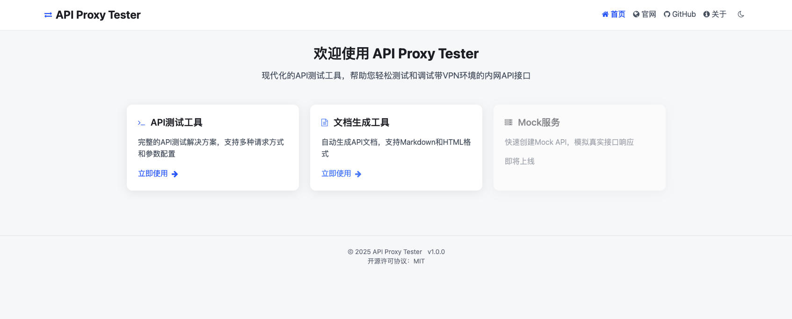
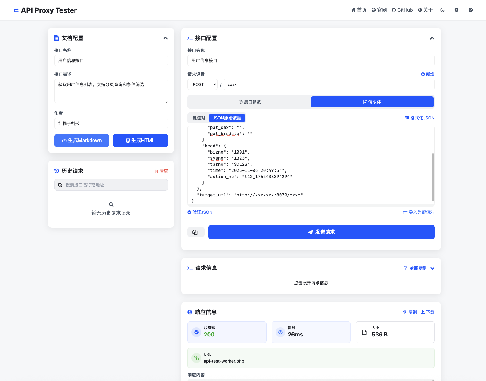
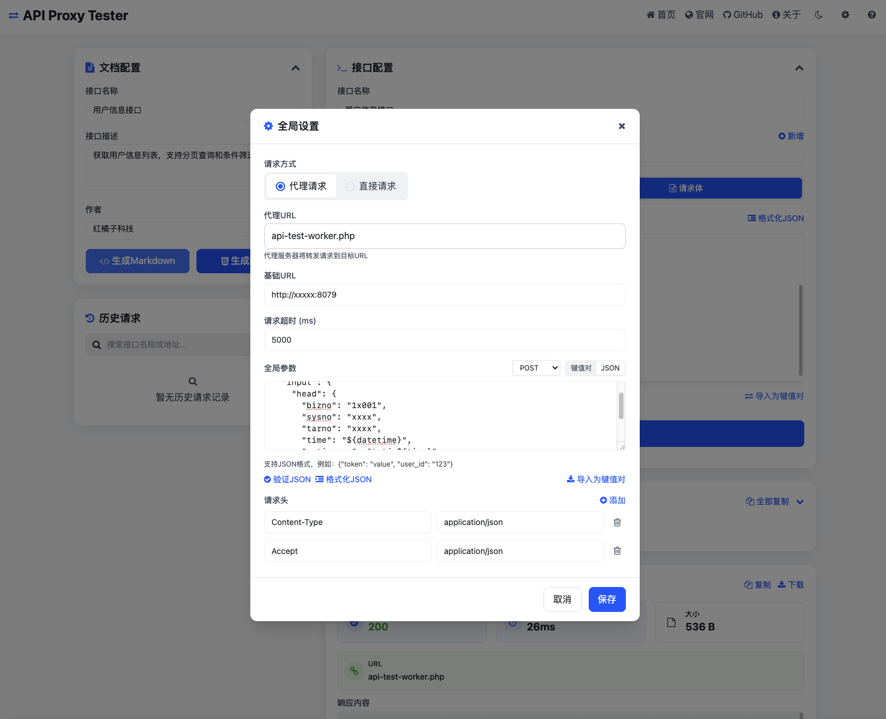

[中文](./README.md) | [English](./README_EN.md)
---

# API Proxy Tester

API代理测试工具，基于Vue 3和Vite构建。核心目标是针对VPN内网环境的接口测试及对接开发，提供简单易用的界面和强大的功能。

[](https://github.com/HongJuZi/API-Proxy-Tester) [](LICENSE) []()

## 功能特性

- 基于Vue 3和Vite构建，快速开发和部署
- 支持多种HTTP方法（GET, POST, PUT, DELETE等）
- 可配置全局参数和请求头
- 请求体支持键值对和JSON原始数据两种模式
- 自动生成接口文档（Markdown/HTML）
- 响应内容格式化和下载
- 参数占位符自动替换
- 历史请求记录

## DEMO演示





## 项目结构

```
API-Proxy-Tester/
├── .gitignore          # Git忽略文件配置
├── LICENSE             # 许可证文件
├── README.md           # 项目说明文档
├── backend/            # 后端相关文件
│   └── api-test-worker.php
├── index.html          # 入口HTML文件
├── package-lock.json   # 依赖锁定文件
├── package.json        # 项目配置和依赖
├── postcss.config.js   # PostCSS配置
├── public/             # 静态资源目录
├── src/                # 源代码目录
│   ├── App.vue         # 根组件
│   ├── assets/         # 资源文件
│   ├── components/     # Vue组件
│   │   ├── forms/      # 表单相关组件
│   │   ├── layout/     # 布局组件
│   │   ├── modals/     # 模态框组件
│   │   ├── response/   # 响应相关组件
│   │   └── settings/   # 设置相关组件
│   ├── main.js         # 入口JavaScript文件
│   ├── pages/          # 页面组件
│   │   ├── AboutPage.vue
│   │   ├── ApiTestPage.vue
│   │   └── HomePage.vue
│   ├── router/         # 路由配置
│   │   └── index.js
│   ├── stores/         # 状态管理(Pinia)
│   │   └── index.js
│   ├── styles/         # 样式文件
│   │   ├── components/ # 组件样式
│   │   ├── main.css    # 主样式文件
│   │   └── tailwind.css # Tailwind CSS样式
│   └── utils/          # 工具函数
│       ├── apiClient.js
│       ├── documentGenerator.js
│       ├── helpers.js
│       ├── modalHelper.js
│       ├── paramProcessor.js
│       └── storage.js
├── tailwind.config.js  # Tailwind CSS配置
└── vite.config.js      # Vite配置
```

## 开发环境搭建

1. 进入项目目录：
   ```bash
   cd API-Proxy-Tester
   ```

2. 安装依赖：
   ```bash
   npm install
   ```

3. 启动开发服务器：
   ```bash
   npm run dev
   ```

4. 构建生产版本：
   ```bash
   npm run build
   ```

5. 预览生产构建：
   ```bash
   npm run serve
   ```

## 占位符使用说明

在全局参数和请求体参数中，支持以下占位符自动替换：

- `${datetime}` - 当前日期时间，格式：YYYY-MM-DD HH:mm:ss
- `${date}` - 当前日期，格式：YYYY-MM-DD
- `${time}` - 当前时间，格式：HH:mm:ss
- `${UUID}` - 生成唯一UUID
- `${s32}` - 生成32位随机字符串
- `${s16}` - 生成16位随机字符串

示例：在JSON中使用 `{"timestamp": "${datetime}", "request_id": "${UUID}"}` 将自动替换为实际值。

---

## 第三方链接

- [Discord](https://discord.com/invite/HongJuZi)
- [Twitter](https://twitter.com/HongJuZi)
- [GitHub](https://github.com/HongJuZi)

## 许可证

MIT License
